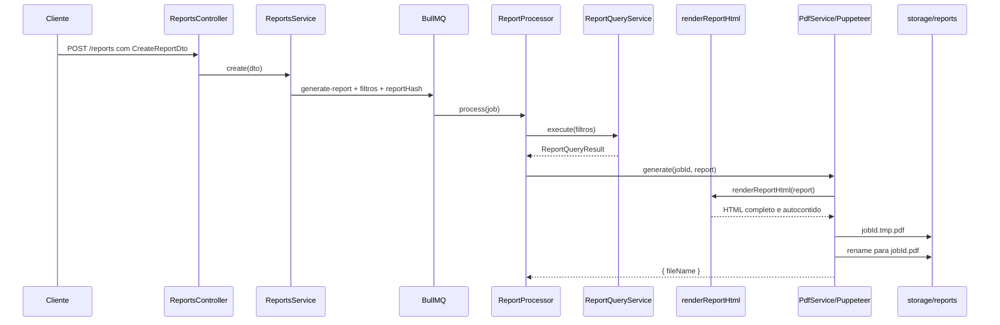

# Fluxo de geração do PDF

Este documento descreve somente a lógica percorrida desde o recebimento dos filtros do relatório até a criação do arquivo PDF pelo Puppeteer.

## Visão geral



## 1. Recebimento e validação dos dados

A geração começa no endpoint `POST /reports`, em `ReportsController.create()`.

O corpo da requisição é convertido para `CreateReportDto`, que aceita:

- `days`: período de 1 a 365 dias;
- `hours`: período de 1 a 24 horas;
- `sampleHours`: amostragem de 1 ou 3 horas;
- `farms`: lista opcional de fazendas/clientes.

O controller exige exatamente uma unidade de período: `days` ou `hours`. As duas juntas, ou as duas ausentes, geram erro antes do enfileiramento.

O controller não consulta o banco e não gera o PDF. Ele entrega o DTO validado para `ReportsService.create()`.

## 2. Criação do job

`ReportsService` calcula um hash a partir dos filtros recebidos. Se já existir um PDF válido no cache, o fluxo termina com o arquivo existente e o Puppeteer não é executado.

Quando não há cache válido, o serviço adiciona à fila BullMQ um job chamado `generate-report` com:

```ts
{
  days?: number;
  hours?: number;
  farms?: string[];
  sampleHours?: 1 | 3;
  reportHash: string;
}
```

A resposta imediata contém o ID do job e o estado `queued`. A geração pesada ocorre posteriormente no worker.

## 3. Processamento e montagem dos dados do relatório

`ReportProcessor.process()` é o ponto que coordena a geração real.

Primeiro, `parseReportJobData()` valida novamente os dados vindos da fila. Essa validação rejeita campos desconhecidos, períodos inválidos, fazendas vazias, amostragem diferente de 1 ou 3 e hash fora do formato esperado.

Depois, o processor chama:

```ts
const report = await reportQuery.execute(data);
```

`ReportQueryService.execute()` transforma os filtros do job em um `ReportQueryResult`:

1. seleciona as fazendas solicitadas ou as fazendas configuradas;
2. obtém a conexão de cada fazenda pelo túnel SSH;
3. consulta os dispositivos cadastrados;
4. valida o endereço de cada dispositivo e ignora os endereços classificados como nobreak;
5. interpreta a classificação e as funções registradas no `CAD_DIR`;
6. identifica o tipo de análise do dispositivo;
7. busca os logs do período solicitado;
8. executa a análise de bateria e de saúde;
9. calcula as estatísticas diárias quando aplicável;
10. adiciona o item normalizado ao relatório.

O resultado entregue à camada de PDF tem esta forma geral:

```ts
type ReportQueryResult = {
  days?: number;
  hours?: number;
  generatedAt: string;
  items: BatteryReportItem[];
};
```

Se uma tabela de logs de um dispositivo não existir, esse dispositivo é tratado sem logs e pode entrar no relatório como dados insuficientes. Outros erros de consulta interrompem o job.

## 4. Conversão dos dados para HTML

Com o `ReportQueryResult` pronto, o processor chama:

```ts
const result = await pdf.generate(job.id, report);
```

Dentro de `PdfService.generate()`, o `jobId` é validado para permitir somente letras, números, `_` e `-`. Esse ID define os nomes dos arquivos e não pode funcionar como um caminho arbitrário.

Em seguida, `renderReportHtml(report)` converte o objeto tipado em uma página HTML completa. Essa função:

- adapta cada `BatteryReportItem` para o modelo visual do relatório;
- separa dispositivos de automação e sensoriamento;
- calcula indicadores agregados usados no painel;
- monta seções, cards, tabelas, gráficos e textos;
- injeta os dados necessários ao JavaScript interno;
- escapa textos dinâmicos antes de inseri-los no HTML;
- inclui no próprio documento o CSS e o JavaScript utilizados na renderização.

O HTML é autocontido: não depende de fontes, folhas de estilo ou scripts externos.

## 5. Geração com Puppeteer

O provider `PuppeteerPdfBrowserLauncher` carrega o Puppeteer dinamicamente e abre o Chromium assim:

```ts
puppeteer.launch({
  args: ['--no-sandbox', '--disable-setuid-sandbox'],
  headless: true,
});
```

O `PdfService` cria uma nova página e injeta o HTML:

```ts
await page.setContent(renderReportHtml(report), {
  waitUntil: 'load',
});
```

O evento `load` é suficiente porque o documento não possui recursos externos. Depois do carregamento, o Chromium imprime a página com:

```ts
await page.pdf({
  path: temporaryPath,
  format: 'A4',
  landscape: true,
  printBackground: true,
});
```

Portanto, o PDF é gerado em A4, orientação paisagem e com cores/imagens de fundo habilitadas.

## 6. Escrita atômica do arquivo

O diretório vem da configuração `reports.storagePath`. Antes de gerar o PDF, o serviço garante que ele exista.

Para um job com ID `54`, por exemplo, são definidos:

```txt
temporário: <storagePath>/54.tmp.pdf
final:      <storagePath>/54.pdf
```

O Puppeteer escreve primeiro no caminho temporário. Somente após terminar com sucesso, o serviço renomeia o arquivo para o caminho final. Assim, outro componente não encontra um PDF final parcialmente escrito.

Ao concluir, `PdfService.generate()` retorna:

```ts
{ fileName: '54.pdf' }
```

## 7. Tratamento de falhas e encerramento

Se ocorrer erro ao abrir o navegador, montar a página, carregar o HTML, imprimir ou renomear o arquivo:

1. o arquivo temporário é removido, se existir;
2. o erro volta ao `ReportProcessor`;
3. o processor registra a falha e lança `Report generation failed`;
4. o BullMQ marca o job como falho.

Independentemente de sucesso ou erro, a página e o navegador são fechados com `Promise.allSettled()`. Uma falha no fechamento não substitui o resultado principal da geração.

## Arquivos que implementam este fluxo

- `src/modules/reports/dto/create-report.dto.ts`: formato e validação da entrada;
- `src/modules/reports/reports.controller.ts`: recebimento da requisição;
- `src/modules/reports/reports.service.ts`: cache e criação do job;
- `src/modules/queue/report-job.types.ts`: contrato e validação dos dados da fila;
- `src/modules/queue/report.processor.ts`: coordenação da consulta e do PDF;
- `src/modules/reports/report-query.service.ts`: montagem do `ReportQueryResult`;
- `src/modules/reports/report-query.types.ts`: contrato dos dados entregues ao PDF;
- `src/modules/pdf/report-html.ts`: transformação dos dados em HTML;
- `src/modules/pdf/pdf.service.ts`: carregamento do HTML e impressão do PDF;
- `src/modules/pdf/pdf.providers.ts`: inicialização real do Puppeteer;
- `src/modules/pdf/pdf.adapters.ts`: contratos usados pela camada de PDF.
